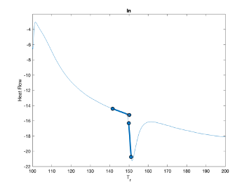
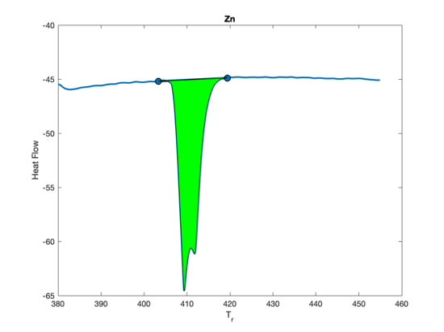

# DSC-TGA-Analysis
Code for analysing data from Mettler Toldeo TGA/DSC for calibration of instrument (T, H, tau lag) using txt table exported data.

Methods Available:
	1. DSC_file_read.m [*Not for tau-lag*]- find enthalpy, and extrapolated temperature compared to literature
	2. m_total_calib - finds tau-lag, and extrapolated onset temperature for files within a selected folder (usually one element in a calibration).

# Method 1 - DSC_file_read.m (preferred)
	* select the .txt files you want to process
	* When prompted you will need to draw the extrapolated onset temperature by drawing with the mouse. You can zoom in and change each line once drawn until you hit return in the console to indicate you are happy with the position. Next you will be prompted to draw the enthalpy integration line. This needs to go bridge the transformation curve. (See below for examples)

 

 

	* The program will do the rest comparing to literature data and plotting. Figures are automatically saved
	* If you want to export the data into excel - set exportq=1 on line 5.

# Method 2 - m_total_calib (deprecated)
	* Files in the target directory must all be named following the convention in 'DSC-TGA-Analysis/Tot Calib Ar gas/*' (e.g Al, 0.083 K per min.txt)
	* Once you select the folder of the element you are interested in, the program will read all text files in the folder to extract the data.
	* When prompted you will need to draw the extrapolated onset temperature by drawing with the mouse. You can zoom in and change each line once drawn until you hit return in the console to indicate you are happy with the position
	* The program will calculate the tau lag and extrapolated onset temperature, save the workspace in the selected directory, and plot the results.
	* Once this is done for every calibration element, use m_extrapdata to collect the data and plot - This requires that you have the SLM tools admin on your path as it is used to fit splines (https://www.mathworks.com/matlabcentral/fileexchange/24443-slm-shape-language-modeling)
	* Select the parent directory of the calibration data (e.g DSC-TGA-Analysis/Tot Calib Ar gas)
	* The code will then collect the data from the mat files, fit and plot the data, finally saving the results database (DB) as a mat file
	* Now open m_metaanalysis.m to put all of the data together, plot enthalpy results, and save final results structure to excel (e.g Summary Data from DSC Total calibration)